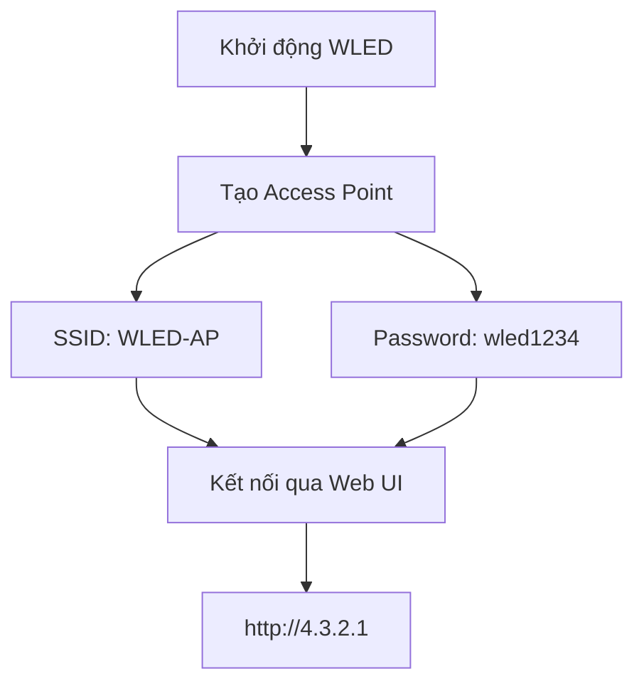
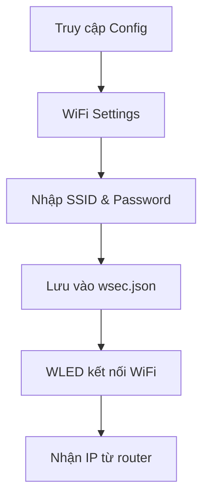
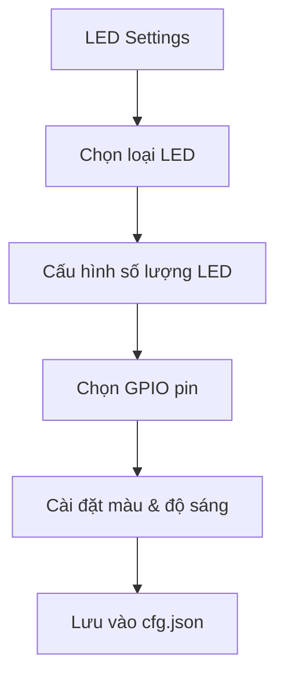
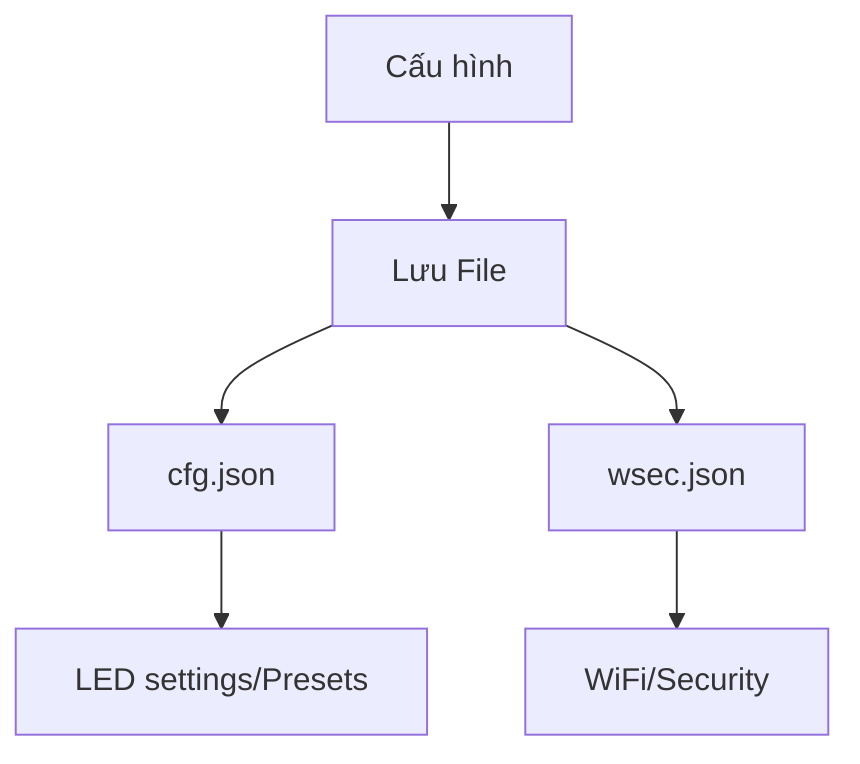
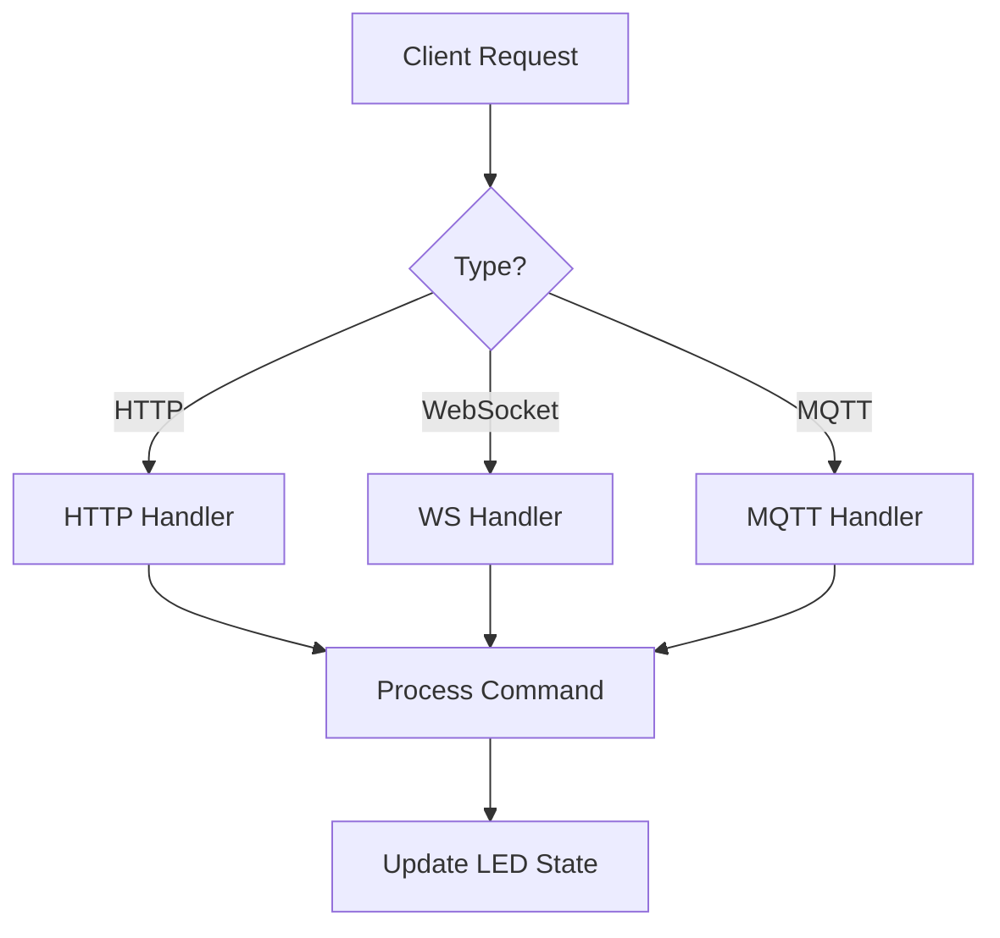
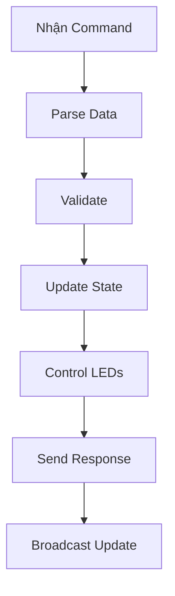
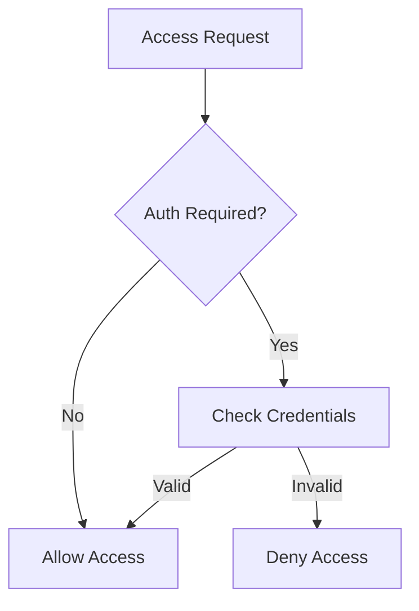

# Tài Liệu Dự Án WLED

## 1. Tổng Quan Dự Án
- **Tên**: WLED
- **Mục đích**: Điều khiển LED WS2812B qua WiFi/MQTT
- **Nền tảng**: ESP32-WROOM-IE
- **Framework**: Arduino/ESP-IDF

Tôi sẽ tìm kiếm các phương thức giao tiếp khác trong WLED:

Search files...
Dựa trên kết quả tìm kiếm, tôi thấy WLED hỗ trợ nhiều phương thức giao tiếp khác nhau:

1. HTTP API:
- Endpoint chính: `/json`
- Các sub-endpoints:
  - `/json/state` - Trạng thái hiện tại
  - `/json/info` - Thông tin hệ thống
  - `/json/si` - State và Info
  - `/json/nodes` - Thông tin các node
  - `/json/eff` - Hiệu ứng
  - `/json/palx` - Bảng màu
  - `/json/fxda` - Dữ liệu hiệu ứng
  - `/json/net` - Cài đặt mạng
  - `/json/cfg` - Cấu hình

2. MQTT:
- Topic chính: `wled/<deviceid>`
- Các sub-topics:
  - `/col` - Điều khiển màu sắc
  - `/api` - API JSON
  - Các topic tùy chỉnh cho usermod

3. WebSocket:
- Endpoint: `/ws`
- Hỗ trợ gửi/nhận dữ liệu realtime

4. Serial API:
- Hỗ trợ giao tiếp qua cổng Serial
- Các lệnh JSON và binary
- Điều khiển LED trực tiếp

5. UDP API:
- Hỗ trợ điều khiển qua UDP
- Các lệnh JSON và HTTP API

6. HTTP Pull:
- Cho phép WLED pull dữ liệu từ server HTTP khác
- Hỗ trợ JSON response

7. RF433:
- Điều khiển qua tín hiệu RF 433MHz
- Cấu hình qua file remote433.json

8. Alexa API:
- Tích hợp với Amazon Alexa
- Điều khiển bằng giọng nói

Mỗi phương thức có ưu điểm riêng:
- HTTP API: RESTful, dễ sử dụng
- MQTT: Realtime, nhẹ
- WebSocket: Realtime, 2 chiều
- Serial: Tốc độ cao, local
- UDP: Nhanh, broadcast
- HTTP Pull: Pull-based
- RF433: Điều khiển từ xa
- Alexa: Giọng nói


## 2. Cấu Trúc Dự Án

### 2.1 File Cốt Lõi
- `wled.h`: File header chính chứa các định nghĩa và khai báo
- `wled.cpp`: Triển khai chính của WLED
- `wled_main.cpp`: Điểm khởi đầu chương trình

### 2.2 Giao Thức Truyền Thông
- `mqtt.cpp`: Hỗ trợ MQTT
- `udp.cpp`: Xử lý UDP
- `network.cpp`: Quản lý kết nối mạng
- `ws.cpp`: Máy chủ WebSocket
- `remote.cpp`: Điều khiển từ xa

### 2.3 Điều Khiển LED
- `led.cpp`: Điều khiển LED cơ bản
- `FX.cpp` & `FX.h`: Hiệu ứng LED
- `FX_2Dfcn.cpp`: Hiệu ứng LED 2D
- `colors.cpp`: Quản lý màu sắc
- `palettes.h`: Bảng màu

### 2.4 Giao Diện Web
- `html_ui.h`: Giao diện người dùng web
- `html_settings.h`: Trang cài đặt
- `wled_server.cpp`: Máy chủ web

### 2.5 Cấu Hình
- `cfg.cpp`: Quản lý cấu hình
- `const.h`: Hằng số
- `my_config.h`: Cấu hình người dùng

## 3. Tính Năng Chính

### 3.1 Điều Khiển LED
- Hỗ trợ LED WS2812B
- Nhiều hiệu ứng có sẵn
- Điều chỉnh độ sáng và màu sắc
- Hỗ trợ ma trận 2D

### 3.2 Kết Nối
- WiFi (Chế độ AP & Client)
- MQTT
- UDP
- WebSocket
- Art-Net & E1.31

### 3.3 Giao Diện Người Dùng
- Giao diện web
- API JSON
- Điều khiển MQTT
- Điều khiển từ xa

### 3.4 Tính Năng Nâng Cao
- Preset & Playlist
- Sự kiện theo thời gian
- Phản ứng âm thanh
- Nhiều phân đoạn
- Hiệu ứng thời gian thực

## 4. Các Hàm Điều Khiển LED (`led.cpp`)

### 4.1 Hàm Quản Lý Phân Đoạn
```cpp
void setValuesFromMainSeg()
void setValuesFromFirstSelectedSeg()
void setValuesFromSegment(uint8_t s)
```
- Mục đích: Lấy giá trị màu và hiệu ứng từ phân đoạn chính hoặc đã chọn
- Giá trị: Màu chính (colPri), Màu phụ (colSec), hiệu ứng, tốc độ, cường độ, bảng màu

### 4.2 Hàm Áp Dụng Giá Trị
```cpp
void applyValuesToSelectedSegs()
```
- Áp dụng giá trị toàn cục cho các phân đoạn đã chọn
- Cập nhật: tốc độ, cường độ, bảng màu, chế độ hiệu ứng, màu sắc

### 4.3 Hàm Điều Khiển Độ Sáng
```cpp
void toggleOnOff()      // Bật/tắt LED
void scaledBri()        // Điều chỉnh độ sáng với hệ số
void applyBri()         // Áp dụng độ sáng tạm thời
void applyFinalBri()    // Áp dụng độ sáng cuối cùng
```

### 4.4 Hàm Quản Lý Trạng Thái
```cpp
void stateUpdated(byte callMode)     // Xử lý thay đổi trạng thái
void updateInterfaces(uint8_t callMode) // Cập nhật giao diện
void handleTransitions()             // Xử lý hiệu ứng chuyển tiếp
void colorUpdated(byte callMode)     // Cập nhật màu
void handleNightlight()              // Chế độ đèn ngủ
```

## 5. Hiệu Ứng LED (`FX.cpp`)

### 5.1 Hiệu Ứng Cơ Bản
```cpp
uint16_t mode_static()    // Đèn tĩnh
uint16_t mode_blink()     // Nhấp nháy
uint16_t mode_strobe()    // Đèn nháy nhanh
uint16_t mode_breath()    // Hiệu ứng thở
uint16_t mode_fade()      // Mờ dần
```

### 5.2 Hiệu Ứng Chuyển Động
```cpp
uint16_t mode_scan()           // Quét
uint16_t mode_dual_scan()      // Quét kép
uint16_t mode_running_lights() // Đèn chạy
uint16_t mode_comet()         // Sao băng
```

### 5.3 Hiệu Ứng Màu Sắc
```cpp
uint16_t mode_rainbow()     // Cầu vồng
uint16_t mode_colorwaves()  // Sóng màu
uint16_t mode_palette()     // Bảng màu
```

### 5.4 Hiệu Ứng Đặc Biệt
```cpp
uint16_t mode_fireworks()  // Pháo hoa
uint16_t mode_fire_2012()  // Lửa
uint16_t mode_lightning()  // Sấm chớp
uint16_t mode_ripple()     // Gợn sóng
```

### 5.5 Hiệu Ứng 2D
```cpp
uint16_t mode_2Dmatrix()  // Ma trận
uint16_t mode_2Dnoise()   // Nhiễu
uint16_t mode_2Dplasma()  // Plasma
```

### 5.6 Hiệu Ứng Hạt
```cpp
uint16_t mode_particles()     // Hệ thống hạt
uint16_t mode_particlefire()  // Lửa hạt
uint16_t mode_particlestorm() // Bão hạt
```

### 5.7 Hiệu Ứng Âm Thanh
```cpp
uint16_t mode_freqwave()   // Sóng tần số
uint16_t mode_gravfreq()   // Tần số trọng lực
uint16_t mode_waterfall()  // Thác nước
```

### 5.8 Cấu Trúc Hỗ Trợ
```cpp
struct Ripple {
    uint8_t state;    // Trạng thái
    uint8_t color;    // Màu sắc
    uint16_t pos;     // Vị trí
}

struct Ball {
    unsigned long lastBounceTime;  // Thời điểm nảy cuối
    float impactVelocity;         // Vận tốc va chạm
    float height;                 // Độ cao
}
```

### 5.9 Tham Số Hiệu Ứng
Mỗi hiệu ứng bao gồm:
- Tham số tốc độ
- Tham số cường độ
- Bảng màu
- Thời gian khung hình
- Trạng thái phân đoạn

### Lưu ý
Với esp32:
```cpp
#define MAX_LEDS 8192          // Số LED tối đa
#define MAX_LED_MEMORY 64000   // Bộ nhớ LED tối đa
#define WLED_MAX_BUSSES 24     // Số bus tối đa
#define OUTPUT_MAX_PINS 5      // Số chân tối đa cho mỗi output
```


# Tài Liệu WLED cho ESP32/ESP8266

## 1. Cấu Hình Chân GPIO cho ESP8266

### Chân GPIO Mặc Định
```cpp
// Chân mặc định cho WS2812B trên ESP8266
#define DEFAULT_LED_PIN 2    // GPIO2 (D4) trên Wemos D1 mini
```

### Bảng Ánh Xạ GPIO ESP8266
| NodeMCU/Wemos Pin | GPIO |
|-------------------|------|
| D0 | GPIO16 |
| D1 | GPIO5 (SCL) |
| D2 | GPIO4 (SDA) |
| D3 | GPIO0 |
| D4 | GPIO2 (LED_BUILTIN, LED mặc định) |
| D5 | GPIO14 (SCLK) |
| D6 | GPIO12 (MISO) |
| D7 | GPIO13 (MOSI) |
| D8 | GPIO15 |
| TX | GPIO1 |
| RX | GPIO3 |

## 2. Cấu Hình ESP32-WROOM-32

### Tổng Quan GPIO
```cpp
// Tổng số GPIO vật lý: 34 chân
// GPIO có thể sử dụng: 25 chân
// - GPIO0-GPIO19
// - GPIO21-GPIO23
// - GPIO25-GPIO27
// - GPIO32-GPIO33
```

### Phân Loại GPIO
1. **GPIO Input/Output (LED)**:
   - GPIO0-GPIO19
   - GPIO21-GPIO23 
   - GPIO25-GPIO27
   - GPIO32-GPIO33

2. **Input Only**:
   - GPIO34-GPIO39

3. **GPIO Đặc Biệt**:
   - GPIO0: Boot fail if pulled low
   - GPIO1: TX pin
   - GPIO3: RX pin
   - GPIO6-GPIO11: SPI flash
   - GPIO12: Boot fail if pulled high

## 3. Bus và Output Configuration

### Định Nghĩa Bus
- Bus là kênh điều khiển LED độc lập
- ESP32 hỗ trợ tối đa 24 bus
- Mỗi bus có thể điều khiển LED với cùng giao thức

### Ví Dụ Cấu Hình Bus

#### 1. Bus Đơn Giản (WS2812B - 1 chân)
```cpp
BusConfig config1 = {
    .type = TYPE_WS2812_RGB,
    .pins = {16, 255, 255, 255, 255}, // GPIO16
    .start = 0,
    .count = 60  // 60 LED
};
```

#### 2. Bus 2 Chân (APA102/SK9822)
```cpp
BusConfig config2 = {
    .type = TYPE_APA102,
    .pins = {23, 18, 255, 255, 255}, // Data + Clock
    .start = 0,
    .count = 60
};
```

#### 3. Bus Analog RGBW (4 chân)
```cpp
BusConfig config3 = {
    .type = TYPE_ANALOG_4CH,
    .pins = {16, 17, 18, 19, 255}, // R, G, B, W
    .start = 0,
    .count = 1
};
```

## 4. Điều Khiển Nhiều LED Strip

### Cách 1: Đấu Nối Tiếp (Recommended)
```cpp
BusConfig config = {
    .type = TYPE_WS2812_RGB,
    .pins = {16, 255, 255, 255, 255}, // GPIO16
    .start = 0,
    .count = 300,  // Tổng số LED của 5 dải
};
```

**Ưu điểm**:
- Chỉ cần 1 GPIO
- Dễ điều khiển
- Đồng bộ tốt

**Nhược điểm**:
- Không điều khiển riêng từng dải
- Tín hiệu có thể suy giảm

### Cách 2: Đấu Song Song
```cpp
BusConfig configs[] = {
    {TYPE_WS2812_RGB, {16}, 0, 60},  // Strip 1
    {TYPE_WS2812_RGB, {17}, 0, 60},  // Strip 2
    {TYPE_WS2812_RGB, {18}, 0, 60},  // Strip 3
    {TYPE_WS2812_RGB, {19}, 0, 60},  // Strip 4
    {TYPE_WS2812_RGB, {21}, 0, 60}   // Strip 5
};
```

**Ưu điểm**:
- Điều khiển độc lập
- Tín hiệu không suy giảm
- Hiệu ứng đa dạng

**Nhược điểm**:
- Tốn nhiều GPIO
- Phức tạp trong lập trình

## 5. Tính Toán Nguồn Điện
```cpp
// Công thức tính dòng điện:
LED_CURRENT = 60mA      // mỗi LED (RGB đầy đủ)
STRIP_LENGTH = 60       // LED mỗi dải
NUM_STRIPS = 5         // Số dải LED

Total_Current = LED_CURRENT * STRIP_LENGTH * NUM_STRIPS
// = 60mA * 60 * 5 = 18A
```

### Yêu Cầu Nguồn:
- Nguồn 5V/20A cho LED
- Tụ 1000μF gần mỗi dải LED
- GND chung ESP32 và LED

## 6. Sơ Đồ Đấu Nối

### Nối Tiếp:
```
┌─────────┐
│         │                  ┌──────┐    ┌──────┐    ┌──────┐
│  ESP32  ├──GPIO16─────DIN─┤Strip1├DOUT┤Strip2├DOUT┤Strip3├─...
│         │                  └──────┘    └──────┘    └──────┘
└─────────┘
```

### Song Song:
```
┌─────────┐
│         ├──GPIO16─────DIN─┤Strip1├
│         ├──GPIO17─────DIN─┤Strip2├
│  ESP32  ├──GPIO18─────DIN─┤Strip3├
│         ├──GPIO19─────DIN─┤Strip4├
│         ├──GPIO21─────DIN─┤Strip5├
└─────────┘
```

## 7. Giới Hạn Hệ Thống

### ESP32:
```cpp
#define WLED_MAX_BUSSES 24    // Số bus tối đa
#define MAX_LEDS 8192         // Số LED tối đa
#define MAX_LEDS_PER_BUS 2048 // SỐ LED tối đa trên mối bus
#define OUTPUT_MAX_PINS 5     // Số chân mỗi output
```

### ESP8266:
```cpp
#define MAX_LEDS 1664         // Số LED tối đa
#define MAX_LED_MEMORY 4000   // Bộ nhớ LED tối đa
```
Tôi sẽ giải thích cách thiết lập WLED cho cầu thang sử dụng ESP32. Đây là hướng dẫn chi tiết:

# Hướng Dẫn Cài Đặt WLED Cho Cầu Thang

## 1. Phân Tích Yêu Cầu

### Cấu Trúc Thông Thường của Cầu Thang
- Mỗi bậc thang cần 1 dải LED
- Thông thường cầu thang có 10-20 bậc
- Mỗi bậc có thể dùng 20-30 LED tùy chiều rộng

### Giải Pháp Đề Xuất
1. **Phương Pháp Đấu Nối**:
   - Đấu nối tiếp các dải LED (khuyến nghị)
   - Dùng 1 GPIO pin để điều khiển
   - Dễ lắp đặt và bảo trì

2. **Cảm Biến Chuyển Động**:
   - PIR sensor ở đầu và cuối cầu thang
   - Tự động bật/tắt khi có người

## 2. Cấu Hình Phần Cứng

### Linh Kiện Cần Thiết
```
1. ESP32 WROOM
2. Dải LED WS2812B
3. Nguồn 5V (công suất phù hợp)
4. 2 cảm biến PIR HC-SR501
5. Tụ điện 1000μF
6. Dây dẫn
```

### Tính Toán Nguồn Điện
```
Ví dụ cho cầu thang 15 bậc:
- Mỗi bậc: 30 LED
- Tổng LED: 15 x 30 = 450 LED
- Dòng điện: 450 x 60mA = 27A
=> Cần nguồn 5V/30A
```

## 3. Cấu Hình WLED

### Cài Đặt Ban Đầu
```cpp
// Trong file wled00/wled.h
#define LEDPIN 16  // Chân GPIO cho LED
#define BTNPIN -1  // Không dùng nút nhấn
#define IR_PIN -1  // Không dùng IR
#define RLYPIN -1  // Không dùng relay
```

### Cấu Hình LED
```cpp
// Trong platformio.ini
build_flags =
  -D WLED_MAX_LEDS=450
  -D WLED_MAX_SEGMENTS=15
  -D BTNPIN=-1
  -D RLYPIN=-1
  -D WLED_DISABLE_INFRARED
```

### Cấu Hình Cảm Biến
```cpp
// Thêm vào usermod.cpp
#define PIR_PIN_TOP 17     // Cảm biến đầu cầu thang
#define PIR_PIN_BOTTOM 18  // Cảm biến cuối cầu thang
```

## 4. Sơ Đồ Đấu Nối

```
┌─────────────────────┐
│       ESP32         │
├─────────────────────┤
│ GPIO16 ────────────┐│
│ GPIO17 ──── PIR1   ││
│ GPIO18 ──── PIR2   ││
│ GND ───────────────┘│
└─────────────────────┘
         │
    ┌────┘
    │    
┌───┴───┐    ┌───────┐    ┌───────┐
│Strip 1├────┤Strip 2├────┤Strip 3├──── ...
└───────┘    └───────┘    └───────┘
```

## 5. Hiệu Ứng Đề Xuất

### Hiệu Ứng Lên Cầu Thang
```json
{
  "name": "Lên Cầu Thang",
  "segments": [
    {
      "start": 0,
      "stop": 450,
      "effect": "Scan",
      "speed": 2000,
      "intensity": 128,
      "palette": "Default"
    }
  ]
}
```

### Hiệu Ứng Xuống Cầu Thang
```json
{
  "name": "Xuống Cầu Thang",
  "segments": [
    {
      "start": 0,
      "stop": 450,
      "effect": "Scan",
      "speed": 2000,
      "intensity": 128,
      "palette": "Default",
      "reverse": true
    }
  ]
}
```

## 6. Lắp Đặt Thực Tế

1. **Chuẩn Bị Bề Mặt**:
   - Làm sạch bề mặt cầu thang
   - Đánh dấu vị trí đặt LED
   - Chuẩn bị rãnh đi dây

2. **Lắp Đặt LED**:
   - Dán LED theo từng bậc
   - Nối tiếp các dải LED
   - Đảm bảo chiều mũi tên trên LED strip

3. **Lắp Đặt Cảm Biến**:
   - Đặt PIR1 ở đầu cầu thang
   - Đặt PIR2 ở cuối cầu thang
   - Điều chỉnh độ nhạy cảm biến

4. **Nguồn Điện**:
   - Đặt nguồn ở vị trí thông thoáng
   - Thêm tụ điện gần điểm cấp nguồn
   - Đảm bảo dây nguồn đủ tiết diện

## 7. Cài Đặt Phần Mềm

1. Nạp firmware WLED
2. Kết nối WiFi
3. Cấu hình LED:
   - Số lượng LED
   - Loại LED: WS2812B
   - Thứ tự màu: GRB

4. Tạo preset cho:
   - Lên cầu thang
   - Xuống cầu thang
   - Chế độ ban đêm (độ sáng thấp)

Bạn cần thêm thông tin chi tiết về phần nào không?

# ĐIỀU KHIỂN WLED TỪ ĐIỆN THOẠI
## Bản tin WLED NHẬN ĐƯỢC TỪ ĐIỆN THOẠI
```JSON
{
  "seg": {
    "fx": 1,
    "fxdef": true
  },
  "v": true,
  "time": 1743754463
}
```
Hãy phân tích từng thành phần:
seg (Segment):
fx: 1 - Đây là ID của hiệu ứng (effect). Mỗi số tương ứng với một hiệu ứng khác nhau trong WLED
fxdef: true - Cho biết đang sử dụng cài đặt mặc định cho hiệu ứng này
v (Verbose):
v: true - Yêu cầu phản hồi đầy đủ từ WLED, bao gồm trạng thái hiện tại
time:
time: 1743754463 - Timestamp Unix, được sử dụng để đồng bộ và theo dõi thời gian gửi lệnh
Ý nghĩa của bản tin này:
Đây là một lệnh thay đổi hiệu ứng LED
Yêu cầu chuyển sang hiệu ứng số 1 với cài đặt mặc định
Yêu cầu WLED phản hồi lại trạng thái đầy đủ sau khi thực hiện thay đổi
Timestamp được đính kèm để theo dõi thời gian gửi lệnh
Để xem hiệu ứng số 1 là gì, tôi sẽ tìm kiếm trong mã nguồn:
Dựa vào kết quả tìm kiếm, tôi có thể giải thích chi tiết bản tin JSON:
Hiệu ứng được yêu cầu (fx=1) là "Blink" - một hiệu ứng nhấp nháy đơn giản:
Chuyển đổi giữa hai màu (color1 và color2)
Tốc độ nhấp nháy có thể điều chỉnh thông qua tham số speed
Chu kỳ sáng/tắt có thể điều chỉnh thông qua tham số intensity (duty cycle)
fxdef: true - Sử dụng cài đặt mặc định cho hiệu ứng này:
Speed: DEFAULT_SPEED
Intensity: DEFAULT_INTENSITY
Custom1: DEFAULT_C1
Custom2: DEFAULT_C2
Custom3: DEFAULT_C3
Các tham số khác như check1, check2, check3 được đặt về false
v: true - Yêu cầu phản hồi đầy đủ:
WLED sẽ gửi lại toàn bộ trạng thái hiện tại sau khi áp dụng hiệu ứng
Bao gồm thông tin về màu sắc, độ sáng, và các cài đặt khác
time: 1743754463 - Timestamp Unix:
Dùng để đồng bộ và theo dõi thời gian gửi lệnh
Giúp phân biệt các lệnh khác nhau
Có thể dùng để xử lý theo thứ tự thời gian
Hiệu ứng Blink này sẽ:
Chuyển đổi giữa hai màu đã cài đặt
Sử dụng tốc độ và chu kỳ mặc định
Có thể điều chỉnh sau thông qua các lệnh khác
Phản hồi lại trạng thái đầy đủ sau khi áp dụng

## Bản tin WLED GỬI PHẢN HỒI LÊN ĐIỆN THOẠI
```JSON
{
"state": {
  // Thông tin cơ bản
  "on": true,                // Trạng thái bật/tắt
  "bri": 128,               // Độ sáng (0-255)
  "transition": 7,          // Thời gian chuyển cảnh (giây)
  "bs": 0,                  // Blending style
  "ps": -1,                 // Preset ID (-1 = không có preset)
  "pl": -1,                 // Playlist ID (-1 = không có playlist)
  "ledmap": 0,              // LED mapping đang dùng

  // Audio Reactive
  "AudioReactive": {
    "on": false             // Trạng thái phản ứng âm thanh
  },

  // Night Light
  "nl": {
    "on": false,            // Trạng thái đèn ngủ
    "dur": 60,              // Thời gian (phút)
    "mode": 1,              // Chế độ
    "tbri": 0,              // Độ sáng mục tiêu
    "rem": -1               // Thời gian còn lại
  },

  // UDP Notification
  "udpn": {
    "send": false,          // Gửi thông báo
    "recv": true,           // Nhận thông báo
    "sgrp": 1,             // Nhóm gửi
    "rgrp": 1              // Nhóm nhận
  },

  "lor": 0,                 // Live override
  "mainseg": 0,            // Segment chính

  // Thông tin segment
  "seg": [{
    "id": 0,               // ID segment
    "start": 0,            // LED bắt đầu
    "stop": 30,            // LED kết thúc
    "len": 30,             // Số LED
    "grp": 1,              // Nhóm LED
    "spc": 0,              // Khoảng cách
    "of": 0,               // Offset
    "on": true,            // Trạng thái
    "frz": false,          // Đóng băng hiệu ứng
    "bri": 255,            // Độ sáng segment
    "cct": 127,            // Nhiệt độ màu
    "set": 0,              // Settings
    "col": [               // Màu sắc
      [255,160,0],        // Màu chính (cam)
      [0,0,0],            // Màu phụ
      [0,0,0]             // Màu thứ 3
    ],
    "fx": 1,               // ID hiệu ứng
    "sx": 128,             // Tốc độ hiệu ứng
    "ix": 128,             // Cường độ hiệu ứng
    "pal": 0,              // ID palette màu
    "c1": 128,             // Custom 1
    "c2": 128,             // Custom 2
    "c3": 16,              // Custom 3
    "sel": true,           // Đã chọn
    "rev": false,          // Đảo ngược
    "mi": false,           // Mirror
    "o1": false,           // Option 1
    "o2": false,           // Option 2
    "o3": false,           // Option 3
    "si": 0,               // Sound simulation
    "m12": 0               // Map 1D to 2D
  }]
},
"info": {
  // Thông tin phiên bản
  "ver": "0.16.0-alpha",    // Phiên bản WLED
  "vid": 2412040,           // Version ID
  "cn": "Niji",             // Codename
  "release": "ESP32",       // Platform

  // Thông tin LED
  "leds": {
    "count": 30,            // Tổng số LED
    "pwr": 120,             // Công suất hiện tại (mA)
    "fps": 44,              // Frames per second
    "maxpwr": 850,          // Công suất tối đa (mA)
    "maxseg": 32,           // Số segment tối đa
    "bootps": 0,            // Boot preset
    "seglc": [1],           // Segment light capabilities
    "lc": 1,                // Light capabilities
    "rgbw": false,          // Hỗ trợ RGBW
    "wv": 0,                // White value
    "cct": 0                // CCT support
  },

  // Thông tin phần cứng
  "i2c": [-1,-1],           // I2C pins
  "spi": [-1,-1,-1],        // SPI pins
  
  // Thông tin thiết bị
  "name": "WLED",           // Tên thiết bị
  "brand": "LOCOLOCO",      // Thương hiệu
  "product": "LED_2D",      // Sản phẩm
  "mac": "ec64c991bcb0",    // Địa chỉ MAC
  "ip": "192.168.110.47",   // Địa chỉ IP

  // Thông tin WiFi
  "wifi": {
    "bssid": "EE:B9:70:8B:45:11",
    "rssi": -49,            // Cường độ tín hiệu
    "signal": 100,          // Chất lượng tín hiệu
    "channel": 1,           // Kênh WiFi
    "ap": false,            // Mode AP
    "txPower": 62,          // Công suất phát
    "sleep": false          // Sleep mode
  },

  // Thông tin hệ thống
  "arch": "esp32",          // Kiến trúc
  "core": "v3.3.6-16-gcc5440f6a2", // Phiên bản core
  "clock": 240,             // Tốc độ CPU (MHz)
  "flash": 4,               // Dung lượng flash (MB)
  "freeheap": 189500,       // Bộ nhớ heap còn trống
  "uptime": 28,             // Thời gian hoạt động (giây)
  "time": "2025-4-4, 08:41:48" // Thời gian hiện tại
}
}
```

## Toàn bộ quy trình từ khi nhận bản tin điều khiển từ WS đến khi WLED xử lý và phản hồi WS
Tôi sẽ phân tích chi tiết toàn bộ quy trình xử lý bản tin WebSocket trong WLED:

### 1. Nhận Bản Tin WebSocket
Trong file `ws.cpp`:

```cpp
void wsEvent(AsyncWebSocket * server, AsyncWebSocketClient * client, AwsEventType type, void * arg, uint8_t *data, size_t len) {
  if(type == WS_EVT_DATA) {
    AwsFrameInfo * info = (AwsFrameInfo*)arg;
    if(info->final && info->index == 0 && info->len == len && info->opcode == WS_TEXT) {
      // 1. Kiểm tra và lấy JSON buffer
      if (!requestJSONBufferLock(11)) {
        client->text(F("{\"error\":3}")); // ERR_NOBUF
        return;
      }

      // 2. Parse JSON
      DeserializationError error = deserializeJson(*pDoc, data, len);
      JsonObject root = pDoc->as<JsonObject>();
      
      // 3. Xử lý dữ liệu
      if (!error && !root.isNull()) {
        bool verboseResponse = deserializeState(root);
        if (verboseResponse) {
          sendDataWs(client); // Gửi phản hồi đầy đủ
        } else {
          client->text(F("{\"success\":true}")); // Phản hồi đơn giản
        }
      }
      releaseJSONBufferLock();
    }
  }
}
```

### 2. Xử Lý State (deserializeState)
Trong file `json.cpp`:

```cpp
bool deserializeState(JsonObject root, byte callMode = CALL_MODE_DIRECT_CHANGE) {
  bool stateResponse = root[F("v")] | false;

  // 2.1 Xử lý độ sáng và trạng thái bật/tắt
  bool onBefore = bri;
  getVal(root["bri"], &bri);
  bool on = root["on"] | (bri > 0);
  if (!on != !bri) toggleOnOff();

  // 2.2 Xử lý thời gian transition
  long tr = root[F("transition")] | -1;
  if (tr >= 0) {
    transitionDelay = tr * 100;
    strip.setTransition(transitionDelay);
  }

  // 2.3 Xử lý segment
  JsonArray seg = root["seg"];
  if (!seg.isNull()) {
    for (JsonObject elem : seg) {
      deserializeSegment(elem, elem["id"] | 0);
    }
  }

  // 2.4 Cập nhật trạng thái
  stateUpdated(callMode);
  return stateResponse;
}
```

### 3. Xử Lý Segment (deserializeSegment)
```cpp
bool deserializeSegment(JsonObject elem, byte id) {
  if (id >= strip.getMaxSegments()) return false;
  Segment& seg = strip.getSegment(id);

  // 3.1 Cập nhật thông số segment
  uint16_t start = elem["start"] | seg.start;
  uint16_t stop = elem["stop"] | seg.stop;
  uint8_t grp = elem["grp"] | seg.grouping;
  uint16_t spc = elem[F("spc")] | seg.spacing;
  
  // 3.2 Cập nhật màu sắc
  JsonArray colarr = elem["col"];
  if (!colarr.isNull()) {
    for (uint8_t i = 0; i < 3; i++) {
      JsonArray colX = colarr[i];
      if (!colX.isNull()) {
        seg.colors[i] = RGBW32(colX[0], colX[1], colX[2], colX[3]);
      }
    }
  }

  // 3.3 Cập nhật hiệu ứng
  uint8_t fx = elem["fx"] | seg.mode;
  uint8_t sx = elem["sx"] | seg.speed;
  uint8_t ix = elem["ix"] | seg.intensity;
  
  seg.setMode(fx, sx, ix);
}
```

### 4. Cập Nhật LED (stateUpdated)
Trong file `led.cpp`:

```cpp
void stateUpdated(byte callMode) {
  // 4.1 Cập nhật giao diện
  if (callMode != CALL_MODE_NO_NOTIFY) {
    notify(callMode);
    interfaceUpdateCallMode = callMode;
  }

  // 4.2 Lưu trạng thái
  if (callMode != CALL_MODE_PRESET_NO_SAVE && currentPreset > 0) {
    savedPresets = false;
  }

  // 4.3 Kích hoạt cập nhật LED
  if (bri > 0) strip.trigger();
}
```

### 5. Tạo Phản Hồi (sendDataWs)
```cpp
void sendDataWs(AsyncWebSocketClient * client) {
  // 5.1 Tạo JSON response
  JsonObject state = pDoc->createNestedObject("state");
  serializeState(state);
  JsonObject info = pDoc->createNestedObject("info");
  serializeInfo(info);

  // 5.2 Gửi phản hồi
  size_t len = measureJson(*pDoc);
  AsyncWebSocketMessageBuffer * buffer = ws.makeBuffer(len);
  serializeJson(*pDoc, (char *)buffer->get(), len);
  client->text(buffer);
}
```

### 6. Serialize State
```cpp
void serializeState(JsonObject root) {
  // 6.1 Thông tin cơ bản
  root["on"] = (bri > 0);
  root["bri"] = briLast;
  root[F("transition")] = transitionDelay/100;

  // 6.2 Thông tin segment
  JsonArray seg = root.createNestedArray("seg");
  for (size_t s = 0; s < strip.getMaxSegments(); s++) {
    if (strip.getSegment(s).isActive()) {
      JsonObject seg0 = seg.createNestedObject();
      serializeSegment(seg0, strip.getSegment(s), s);
    }
  }
}
```

### 7. Serialize Info
```cpp
void serializeInfo(JsonObject root) {
  // 7.1 Thông tin phiên bản
  root[F("ver")] = versionString;
  root[F("vid")] = VERSION;

  // 7.2 Thông tin LED
  JsonObject leds = root.createNestedObject("leds");
  leds[F("count")] = strip.getLengthTotal();
  leds[F("pwr")] = strip.currentMilliamps;
  leds["fps"] = strip.getFps();

  // 7.3 Thông tin hệ thống
  root[F("fs")] = freeHeap;
  root[F("uptime")] = millis()/1000;
  // ...
}
```

Quy trình này đảm bảo:
1. Xử lý an toàn dữ liệu JSON
2. Cập nhật trạng thái hệ thống
3. Điều khiển LED theo yêu cầu
4. Phản hồi đầy đủ thông tin cho client

Bạn muốn tìm hiểu sâu hơn về phần nào trong quy trình này?

# Tôi sẽ tóm tắt toàn bộ workflow của WLED từ khi bắt đầu đến khi điều khiển:

1. **Khởi động và Kết nối Ban đầu**


2. **Cấu hình WiFi và Kết nối Mạng**


3. **Cấu hình LED**


4. **Các Phương thức Điều khiển**

a. **HTTP API**
```plaintext
- GET http://<wled-ip>/win  (Simple API)
  - /win&T=1    (Bật)
  - /win&T=0    (Tắt)
  - /win&A=128  (Độ sáng)
  - /win&CL=ff0000  (Màu)

- POST http://<wled-ip>/json/state (JSON API)
  {
    "on": true,
    "bri": 128,
    "seg": [{"col":[[255,0,0]]}]
  }
```

b. **WebSocket**
```plaintext
ws://<wled-ip>/ws
- Realtime updates
- Live preview
- Instant control
```

c. **MQTT**
```plaintext
Topics:
- wled/[deviceId]/c  (Control)
- wled/[deviceId]/v  (Values)
- wled/[deviceId]/s  (Status)
```

5. **Workflow Lưu trữ Cấu hình**


6. **Các File Cấu hình Chính**
```plaintext
/cfg.json
- LED configuration
- Network settings
- MQTT settings
- Hardware pins
- Default values

/wsec.json
- WiFi passwords
- Security credentials
- API tokens
```

7. **Luồng Xử lý Request**


8. **Debug và Monitoring**
```plaintext
Serial Monitor (115200 baud):
- Network status
- Command processing
- Error messages
- State changes
```

9. **Các Endpoint Chính**
```plaintext
/                 - Web Interface
/settings         - Configuration
/json/state      - State Control
/json/info       - Device Info
/win             - Simple Control
/ws              - WebSocket
/update          - OTA Update
```

10. **Quy trình Xử lý Lệnh**


11. **Các Chức năng Chính**
```plaintext
1. LED Control
   - On/Off
   - Brightness
   - Color
   - Effects
   - Segments

2. Network
   - WiFi
   - MQTT
   - HTTP API
   - WebSocket

3. Automation
   - Schedules
   - Presets
   - Macros

4. Sync
   - UDP Sync
   - MQTT Sync
   - HTTP Sync
```

12. **Security Workflow**


Đây là tổng quan về workflow của WLED. Mỗi phần có thể được đi sâu chi tiết hơn tùy theo nhu cầu của bạn. Bạn muốn tìm hiểu sâu hơn về phần nào?

# Kiến trúc và Luồng Hoạt Động Hệ Thống

## 1. Tổng Quan Hệ Thống
- **Local Network**
  - ESP Device (WLED Controller)
  - Local Web Interface
  - Local WebSocket Server
  - Local Storage (SPIFFS/LittleFS)

- **Cloud System**
  - Cloud Server (MQTT Broker)
  - Database
  - WebSocket Server
  - REST API
  - Remote Client Interface

## 2. Các Luồng Hoạt Động Chính

### 2.1. Khởi động thiết bị
1. **Khởi tạo local**
   - Load cấu hình từ bộ nhớ local
   - Khởi tạo LED strip
   - Start WebSocket server local

2. **Kết nối cloud**
   - Kết nối WiFi
   - Kết nối MQTT với cloud server
   - Đăng ký thiết bị với cloud
   - Đồng bộ trạng thái cuối cùng từ cloud

### 2.2. Điều khiển Local
1. **Client gửi lệnh**
   - Local client kết nối WebSocket
   - Gửi command tới ESP
   - Format: `{type: "command", data: {...}}`

2. **ESP xử lý**
   - Nhận command qua WebSocket
   - Cập nhật LED state
   - Lưu state vào local storage
   - Broadcast state mới cho local clients

3. **Đồng bộ với Cloud**
   - Gửi state update lên cloud qua MQTT
   - Nhận confirmation từ cloud
   - Queue changes nếu mất kết nối

### 2.3. Điều khiển Remote
1. **Remote client request**
   - Gửi command tới cloud server
   - Authentication với cloud
   - Format: `{deviceId: "xxx", command: {...}}`

2. **Cloud xử lý**
   - Validate request
   - Forward command tới device qua MQTT
   - Update database state

3. **ESP nhận command**
   - Xử lý MQTT message
   - Update LED state
   - Confirm state change với cloud
   - Broadcast cho local clients

### 2.4. Xử lý Mất Kết Nối

#### Offline Mode
1. **Phát hiện mất kết nối**
   - Timeout MQTT connection
   - Switch sang local-only mode

2. **Local Operation**
   - Tiếp tục xử lý local commands
   - Queue state changes
   - Lưu changes vào local storage

3. **Khôi phục kết nối**
   - Reconnect MQTT
   - Sync queued changes
   - Resolve conflicts nếu có

### 2.5. Đồng bộ Trạng thái

#### Normal Sync
1. **State Change**
   ```json
   {
     "deviceId": "xxx",
     "state": {
       "on": true,
       "brightness": 128,
       "effect": 1,
       "version": 123
     },
     "timestamp": 1234567890
   }
   ```

2. **Sync Process**
   - Save local state
   - Send to cloud
   - Wait for confirmation
   - Update version number

#### Conflict Resolution
1. **Version Check**
   - Compare state versions
   - Check timestamps
   - Resolve based on latest change

2. **Merge Strategy**
   - Keep newer changes
   - Sync back to ensure consistency

## 3. Giao Thức Giao Tiếp

### 3.1. Local WebSocket
```typescript
interface WSMessage {
    type: "command" | "state" | "sync";
    data: {
        command?: LEDCommand;
        state?: DeviceState;
        timestamp: number;
    }
}
```

### 3.2. MQTT Topics
```plaintext
device/{deviceId}/command    # Nhận lệnh
device/{deviceId}/state     # Gửi state
device/{deviceId}/status    # Online/offline status
device/{deviceId}/sync      # Full state sync
```

## 4. Xử Lý Lỗi và Recovery

### 4.1. Network Errors
- Tự động reconnect WiFi
- Retry MQTT connection
- Queue commands khi offline

### 4.2. State Sync Errors
- Version control cho state
- Timestamp-based conflict resolution
- Forced sync khi cần

### 4.3. Recovery Process
1. Reconnect network
2. Verify device registration
3. Sync state with cloud
4. Process queued commands
5. Resume normal operation

## 5. Bảo Mật

### 5.1. Local Security
- Local network access only
- Optional local password
- Token-based authentication

### 5.2. Cloud Security
- SSL/TLS for MQTT
- JWT authentication
- Device registration validation

## 6. State Management

### 6.1. Local State
```json
{
    "device": {
        "id": "unique-id",
        "version": 123
    },
    "state": {
        "on": true,
        "brightness": 128,
        "effect": 1
    },
    "config": {
        "localControl": true,
        "cloudSync": true
    }
}
```

### 6.2. Cloud State
```json
{
    "deviceId": "unique-id",
    "state": {
        "version": 123,
        "lastUpdate": "timestamp",
        "data": {
            "on": true,
            "brightness": 128,
            "effect": 1
        }
    },
    "status": {
        "online": true,
        "lastSeen": "timestamp"
    }
}
```

Bạn cần tôi giải thích chi tiết phần nào không?
